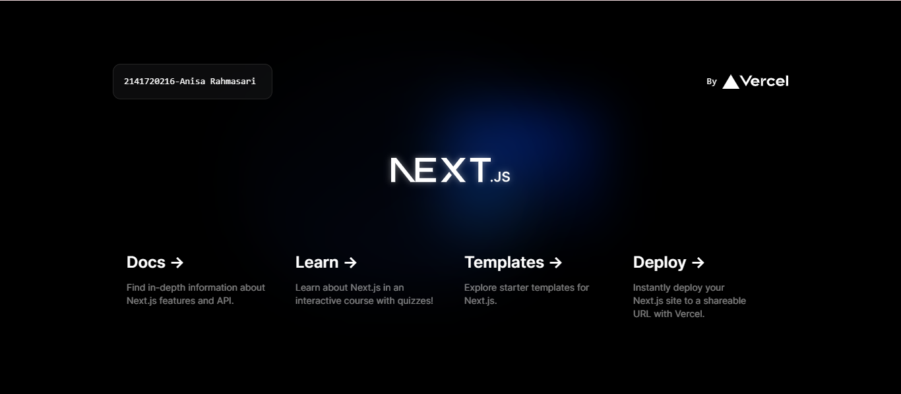
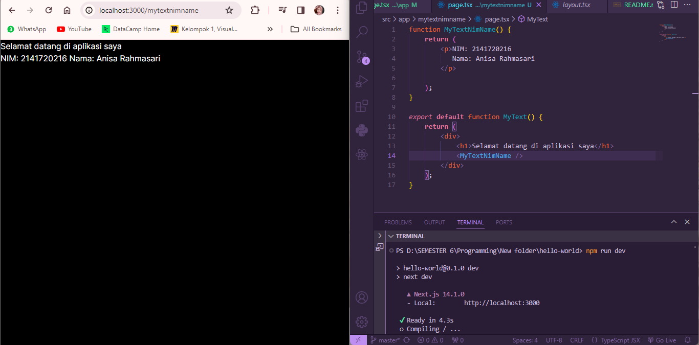
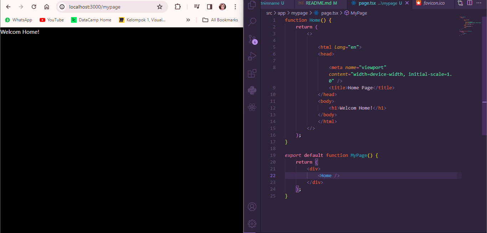
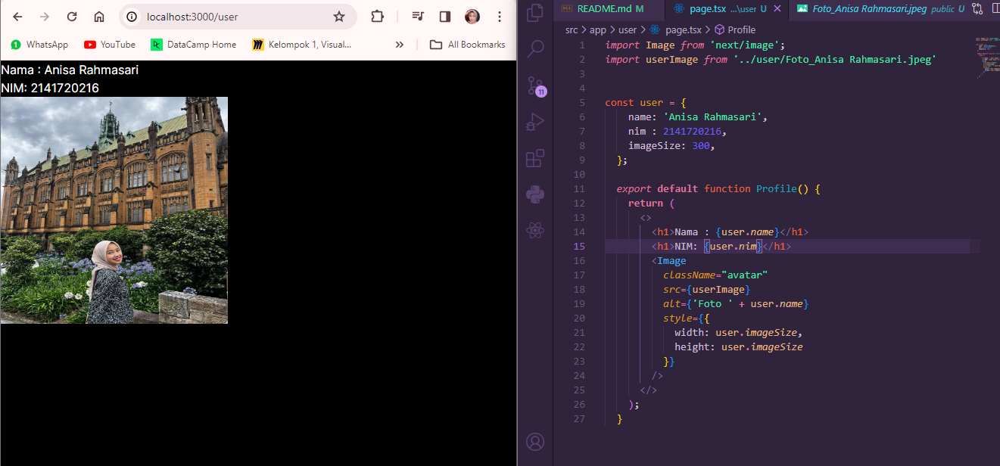
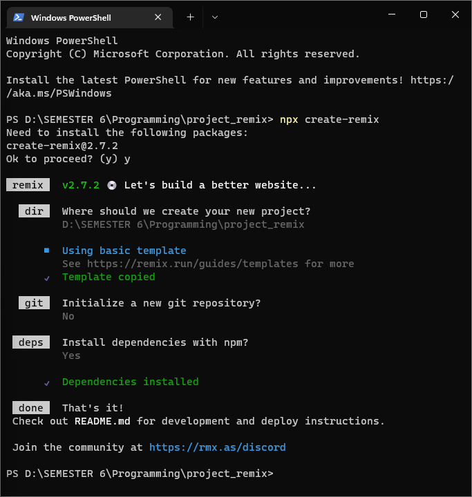
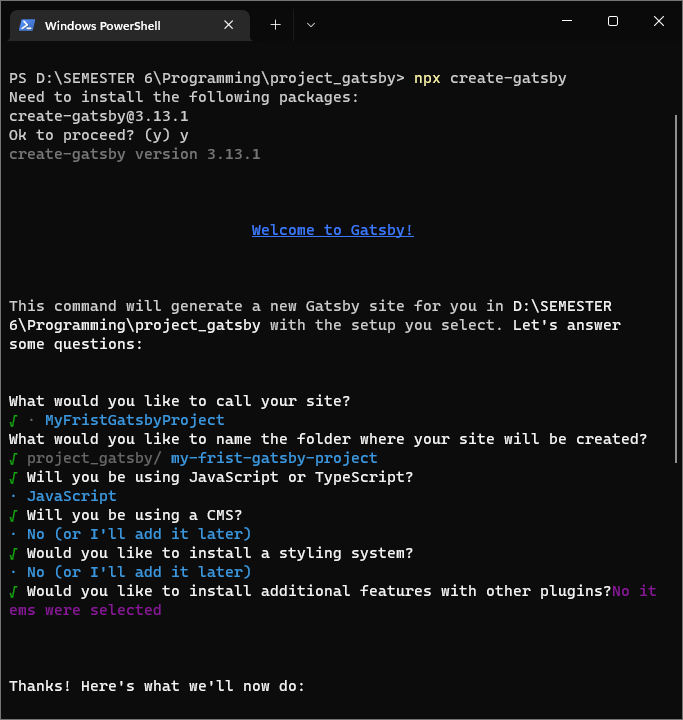

This is a [Next.js](https://nextjs.org/) project bootstrapped with [`create-next-app`](https://github.com/vercel/next.js/tree/canary/packages/create-next-app).

## Pertemuan 02 - Pengenalan React JS | Anisa Rahmasari - 2141720216

First, run the development server:

```bash
npm run dev
# or
yarn dev
# or
pnpm dev
# or
bun dev
```

Open [http://localhost:3000](http://localhost:3000) with your browser to see the result.

You can start editing the page by modifying `app/page.tsx`. The page auto-updates as you edit the file.

This project uses [`next/font`](https://nextjs.org/docs/basic-features/font-optimization) to automatically optimize and load Inter, a custom Google Font.


## Soal 1

- Typescript 

    TypeScript adalah languange programming open source yang dibagun di atas JavaScript. Selain itu, TypeScript menggunakan dua model. yaitu internal dan eksternal. Banyak keunnggulan dari TypeScript, salah satunya TypeScript tidak membutuhkan runtime plugin. Namun, TypeScript juga memiliki kekurangan yaitu memiliki sistem pengetikan yang terlalu rumit. 
- ESLint

    ESLint merupakan salah satu linter JavaScript dan berguna untuk static analyzes supaya dapat menemukan masalah atau potensi bug pada code yg telah dibuat. Selain itu, dengan ESLint code yang kita buat bisa lebih konsisten dan minim bug. Berikut salah satu keuntungan menggunakan ESLint dapat menerima feedback look dengan cepat untuk mengetahui potensi bug pada code lebih awal. 

- Tailwind CSS

    Tailwind CSS merupakan framework CSS yang gunakan untuk mempermudah dan mempercepat pembuatan aplikasi menggunakan desain custom. Framework ini mengutamakan utilitas untuk membuat desain khusus sesuai keinginan developer. Salah satu fungsi Tailwind CSS adalah mengurangi penulisan CSS khusus
- App Router

    Next.js App Router merupakan model terbaru untuk membangun aplikasi menggunakan fitur terbaru dari React seperti, Server Components, Streaming with Suspense, dan Server Actions.
- Import alias

    Import alias yaitu proses mengimport module dan dalam memberikan nama module sesuai keinginan.


## Soal 2
- node_mudules 

    merupakan folder yang berisi paket-paket modul Nodejs. Selain itu, jika menginstall library dengan npm akan disimpan pada folder node_modules

- public

    merupakan folder yang berisi file untuk public, seperti HTML, CSS, icon, gambar, dan aset lainnya. Di dalam folder ini terdapat file index.html yang digunakan untuk aplikasi React untuk render komponen.

- src

    merupakan folder yang berisi kode Reactjs dan merupakan tempat untuk membuat komponen. Didalam folder ini terdapat beberapa file dengan masing-masing kegunaan
    
    - App.js

        berisi komponen utama dari aplikasi
    - App.test.js 

        berisi kode untuk testing komponen App

    - index.js 

        berisi kode untuk render komponen App ke Real DOM

    - serviceWorker.js

        berisi kode untuk service worker yang dibutuhkan untuk membuat aplikasi Progressive Web Apps
    
    - setTests.js

        berisi kode untuk testing aplikasi

- .gitignore

    merupakan kumpulan kode yang diabaikan oleh Git.

- package.json

    merupakan file JSON yang memuat keterangan proyek dan daftar module yang dibutuhkan.

- yarn.lock

    merupakan file yang digunakan Yarn untuk mengunci versi-versi modul Nodejs yang digunakan.

## Soal 3


## Soal 4


Terdapat perubahan tampilan, karena mengubah routing dari http://localhost:3000/ ke http://localhost:3000/mytextnimname

## Soal 5

Terdapat perubahan tampilan, karena mengubah routing dari 
http://localhost:3000 ke http://localhost:3000/mypage

## Soal 6


## Tugas Praktikum
Perbedaan Next.js, gatsby, dan remix

- Next.js adalah React-based framework untuk membangun website yang server-side rendered(SSR)
dan statitically generated (SSG). Salah satu keunggulannya adalah memiliki fitur built-in server-side rendering yang membuat mempercepat saat load page dan meningkatkan SEO.

- Remix adalah framework terbaru untuk membangun modern web applications. REmix juga merupakan cabungan dari fitur-fitur terbaik yaitu server-side rendering dan client-side rendering

- Gatsby adalah static site generator untuk membangun aplikasi web yang cepat dan terukur. Gatsby dapat membantu membangun web yang memiliki performa SEO terbaik. 

Membuat project remix


Membuat project gatsby


